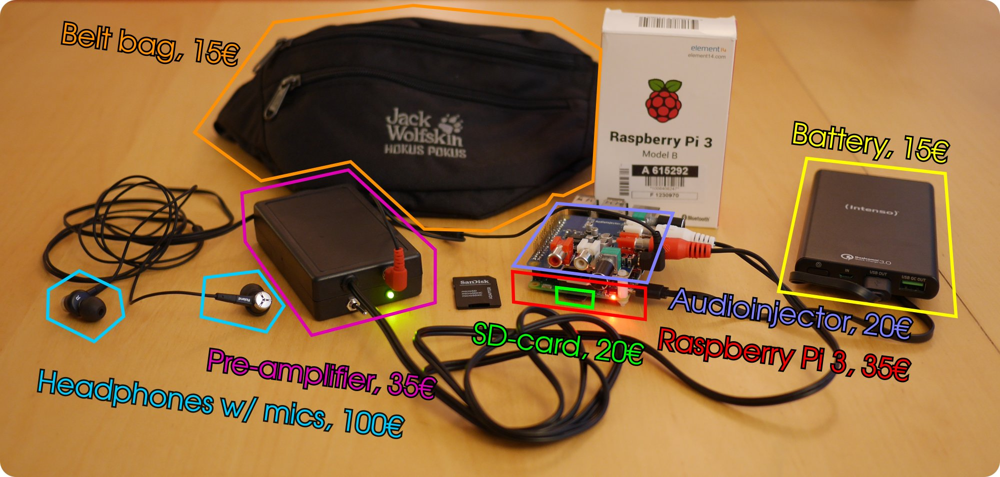

# A mobile hearing aid prototype based on openMHA
This repository holds the information to build a mobile prototype of a hearing aid based on the open Master Hearing Aid ([openMHA](https://www.openmha.org)), a free software platform for real-time audio signal processing.
We developed this prototype for a lab course at the [Carl-von-Ossietzky Universität Oldenburg](https://uni-ol.de) and found that the building instructions could be of public interest.

Corresponding author: Marc René Schädler (marc.r.schaedler@uni-oldenburg.de)

## Aims
The prototype was deliberately designed using affordable consumer hardware and open source software. The aim is to lower the entry barrier for hearing aid development and facilitate any interested person to get actively involved in testing and improving hearing devices; empowering power-users.

## Warning and disclaimer
First, a few words of warning:

Hearing aids are medical products!
You use these instructions and the software at you own risk.
The described device can produce very high sound levels.
**Exposure to high sound levels can permanently damage your hearing!**
*You* are responsible for the configuration of the device and the protection of your hearing.

Please read about the consequences of noise induced hearing loss before proceeding to the fun part: https://www.nidcd.nih.gov/health/noise-induced-hearing-loss

## Main ingredients

Hardware:
* Binaural Microphones/Earphones
* Microphone pre-amplifier
* Raspberry Pi 3 model B
* Low-latency sound card
* USB power bank

Software:
* [openMHA](https://www.openmha.org)
* [Raspbian](http://www.raspbian.org/)
* [JACK](http://www.jackaudio.org/)
* [hostapd](http://w1.fi/hostapd/)
* [OpenSSH](https://www.openssh.com/)
* [GNU/Octave](http://www.octave.org/)

## Main characteristics
* Free software: Control is yours, you can change every single bit of it!
* Efficient real-time implementations of research-approved hearing algorithms (c.f. [openMHA at Github](https://github.com/HoerTech-gGmbH/openMHA))
* Competitively low delays: Less than 10ms
* Looks like wearing in-ear headphones
* Whole setup fits in a belt bag
* Sum of all components is about 250 €

## Some cool features
* Pre-configured SD-card image (~500 Mb) available for download!
* Autostart in about 10 seconds
* Several hours of autonomy
* Connect via wifi to the hearing aid prototype
* Fit it to a specific hearing profile using openMHA's graphical fitting interface
* Extend openMHA with own algorithms
* Combine it with any jack-based software (play, process, or record)

## Instructions
This page is only a teaser :)
The files in this repository only contain the employed openMHA configuration file, a start script, and some example configuration files.
The actual instructions are deployed in the [corresponding wiki](https://github.com/m-r-s/hearingaid-prototype/wiki).
Feel free to test them and contribute.
Be sure to read the [openMHA documentation](https://github.com/HoerTech-gGmbH/openMHA) (pdf files) if you want to dig deeper into signal processing for hearing aids.

